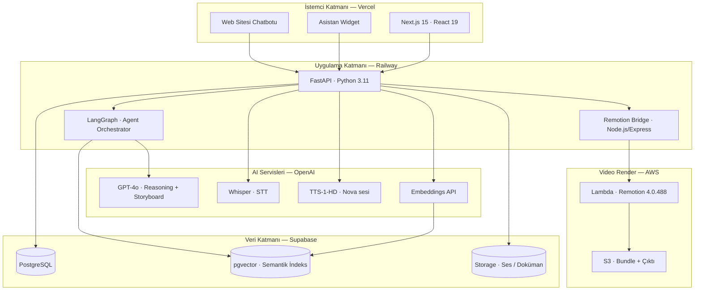
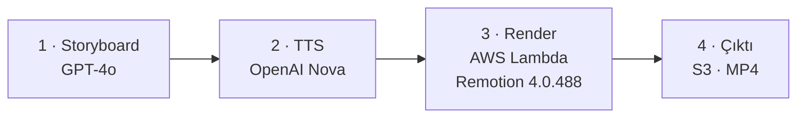
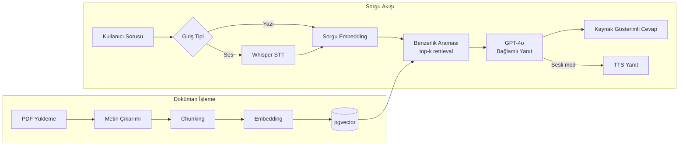
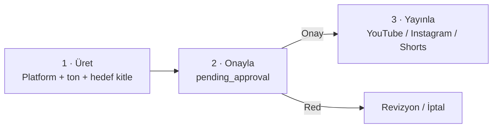

<div align="center">

# AdimOS

### Çok Ajanlı Yapay Zeka İşletim Sistemi

*Kurumsal bilgi tabanı · Sesli asistan · Video prodüksiyon motoru · Müşteri yönetimi*

[](https://nextjs.org/)
[](https://react.dev/)
[](https://fastapi.tiangolo.com/)
[](https://www.python.org/)
[](https://langchain-ai.github.io/langgraph/)
[](https://www.remotion.dev/)
[](https://aws.amazon.com/lambda/)
[](https://supabase.com/)
[](https://openai.com/)

**Adım Müşavirlik & SGS Academy** için geliştirilmiştir.

</div>

---

## İçindekiler

- [Genel Bakış](#genel-bakış)
- [Temel Özellikler](#temel-özellikler)
- [Sistem Mimarisi](#sistem-mimarisi)
- [Video Prodüksiyon Motoru](#video-prodüksiyon-motoru)
- [RAG Pipeline](#rag-pipeline)
- [Çok Ajanlı Sistem](#çok-ajanlı-sistem)
- [Asistan Widget](#asistan-widget)
- [Web Sitesi Chatbotu](#web-sitesi-chatbotu)
- [İçerik Otomasyonu](#içerik-otomasyonu)
- [Teknoloji Yığını](#teknoloji-yığını)
- [Proje Yapısı](#proje-yapısı)
- [Kurulum](#kurulum)
- [Yol Haritası](#yol-haritası)
- [Lisans](#lisans)

---

## Genel Bakış

AdimOS, bir danışmanlık şirketi ile eğitim akademisinin tüm operasyonel iş akışlarını yapay zeka ile otomatize eden **production ortamında çalışan** çok ajanlı bir platformdur.

Sistem dört temel problemi çözer:

1. **Bilgi erişimi** — Yüzlerce sayfalık kurumsal dokümantasyon (PDF, mevzuat, eğitim materyali) pgvector tabanlı bir RAG mimarisiyle indekslenir; çalışanlar ve müşteriler doğal dilde yazılı veya sesli soru sorarak kaynak gösterimli yanıt alır.
2. **Operasyonel otomasyon** — Lead skorlama, müşteri takibi, otomatik follow-up mesajları ve yönetici özetleri, LangGraph üzerinde koşan uzman ajanlar tarafından yürütülür.
3. **Video prodüksiyonu** — Soru çözümü, konu anlatımı ve motivasyon videoları GPT-4o storyboard'u, OpenAI TTS seslendirmesi ve AWS Lambda üzerinde Remotion render'ı ile tamamen otomatik üretilir.
4. **İçerik yayını** — YouTube, Instagram ve Shorts içerikleri AI tarafından üretilir, insan onayından geçer ve platformlara otomatik yayınlanır *(human-in-the-loop)*.

---

## Temel Özellikler

| Modül | Açıklama |
|-------|----------|
| **Bilgi Merkezi** | PDF/doküman yükleme → otomatik chunking → embedding → pgvector semantik arama |
| **Asistan Widget** | Her sayfada floating arayüz; yazılı chat + sesli asistan (Whisper STT / TTS) tek panelde |
| **Video Motoru** | GPT-4o storyboard + OpenAI TTS + Remotion Lambda render; 5 composition türü, 20+ sahne bileşeni |
| **SGS Akademi** | Pedagojik soru çözüm videoları (ChalkboardSolutionScene), 20-25 dk konu anlatımı (LessonVideo) |
| **Agent Ofisi** | 7 uzman AI ajanın durumunu ve çıktılarını izleyen kontrol paneli |
| **İçerik Otomasyonu** | Platform/ton/hedef kitle seçimiyle AI içerik üretimi ve onay akışı |
| **CRM** | Lead skorlama, müşteri yaşam döngüsü takibi, otomatik follow-up |
| **Web Sitesi Chatbotu** | Dış sitelere `<script>` veya `<iframe>` ile gömülen AI asistan; metin, ses ve dosya desteği |
| **Raporlar** | Sistem geneli analitik ve yönetici istatistikleri |

---

## Sistem Mimarisi



**Tasarım kararları:**

- **Frontend ve backend ayrık deploy edilir** (Vercel + Railway) — bağımsız ölçekleme ve sıfır kesintili frontend güncellemeleri için.
- **Remotion Bridge**, Lambda'ya yük bindirmeden FastAPI pipeline'ını soyutlar; devre kesici (circuit breaker) ve warmup mekanizması ile Railway uyku sorununa karşı dayanıklıdır.
- **LangGraph**, ajanlar arası durum yönetimi ve koşullu yönlendirme sağlar; her ajan kendi alt grafiğinde izole çalışır.
- **pgvector**, ayrı bir vektör veritabanı bağımlılığını ortadan kaldırır; ilişkisel veri ve embedding'ler aynı PostgreSQL örneğinde tutularak tek transaction'da tutarlılık korunur.

---

## Video Prodüksiyon Motoru

Tam otomatik, 4 aşamalı pipeline:



### Video Türleri

| Tip | Composition | Format | Açıklama |
|-----|-------------|--------|----------|
| `question_set_long` | QuizVideo | 16:9 | Soru çözümü — ChalkboardSolutionScene, öğretmen sırası |
| `single_question` | QuizVideo | 16:9 / 9:16 | Tek soru pedagojik çözüm |
| `konu_anlatimi` | LessonVideo | 16:9 | 20-25 dk konu anlatımı, 5 sahne tipi |
| `lesson_long` | LessonVideo | 16:9 | Uzun form konu anlatımı |
| `motivation_reel` | MotivationVideo | 9:16 | Motivasyon reeli |
| `educational_reel` | EducationalReel | 9:16 | Kısa eğitim içeriği |
| `infografik` | InfographicVideo | 9:16 | Görsel bilgi kartları |

### Sahne Bileşenleri

**QuizVideo** — Soru çözüm içerikleri:
- `ChalkboardSolutionScene` — Tahta üzerinde pedagojik çözüm: verilenler → yöntem → adım adım → kontrol → sık hata → **doğru şık EN SON**
- `SplitQuizScene` — Yatay bölünmüş ekran; sol soru + şıklar, sağ animasyonlu çözüm adımları
- `SplitQuizVerticalScene` — 9:16 dikey format, aynı mantık
- `IntroScene`, `OutroScene`, `QuestionScene`, `CorrectAnswerScene`, `KeyPointScene`

**LessonVideo** — Konu anlatımı (16:9, beyaz/lacivert/altın tema):
- `LessonTitleScene` — Konu kapağı, ikon ve anahtar nokta
- `LessonConceptScene` — Tanım + madde listesi, sınav bağlantısı
- `LessonCardScene` — Görsel referans kartları (AKTİF/PASİF/BORÇ/ALACAK kategorileri)
- `LessonExampleScene` — Muhasebe yevmiye kaydı + adım adım açıklama
- `LessonSummaryScene` — Kritik noktalar özeti, sınav vurgusu

**MotivationVideo / EducationalReel** — Kısa dikey içerik:
- `MotivationScene` — Gradient arka plan, animasyonlu mesaj

**InfographicVideo** — Bilgi grafikleri:
- `InfographicCardGridScene`, `InfographicComparisonScene`, `InfographicProcessScene`

### TTS Pipeline

Her sahne için ayrı TTS → Supabase Storage → `tts_url` sahnelere eklenir → Remotion `<Audio>` bileşeni render anında senkronize oynatır. Ses süresi `_estimate_duration()` ile hesaplanır, `duration_seconds` otomatik güncellenir.

### Altyapı

| Bileşen | Detay |
|---------|-------|
| Render ortamı | `remotion-render-4-0-488-mem3008mb-disk10240mb-900sec` Lambda |
| S3 bundle | `remotionlambda-eucentral1-bc2ioanhxy` · `eu-central-1` |
| Remotion Bridge | Railway — Express/Node.js, `REMOTION_SERVE_URL` env ile bundle URL alır |
| TTS modeli | `tts-1-hd` · `nova` sesi · `speed=0.93` |
| Storyboard LLM | `gpt-4o` · `temperature=0.35` · `json_object` format |
| Bundle deploy | `cd remotion && npm run deploy:site` |

---

## RAG Pipeline



Her yanıt, dayandığı doküman parçalarına **kaynak referansı** ile döner — halüsinasyon riskini azaltmak ve denetlenebilirlik sağlamak için.

---

## Çok Ajanlı Sistem

7 uzman ajan, LangGraph orkestrasyonu altında çalışır:

| Agent | Sorumluluk | Tetikleyici |
|-------|-----------|-------------|
| **Knowledge Agent** | Doküman işleme ve RAG araması | Doküman yükleme / kullanıcı sorgusu |
| **Voice Agent** | Ses yönlendirme ve intent tespiti | Sesli giriş |
| **CEO Agent** | Günlük/haftalık yönetici özeti | Zamanlanmış görev |
| **CRM Agent** | Lead skorlama ve müşteri takibi | Yeni lead / durum değişikliği |
| **Follow-up Agent** | Otomatik takip mesajları | CRM Agent sinyali |
| **Learning Agent** | Öğrenci analizi ve öğrenme planı | SGS Akademi modülü |
| **Automation Agent** | Sosyal medya içerik üretimi ve yayını | Kullanıcı talebi + onay |

Ajanlar birbirinden bağımsız çalışır ancak ortak durum *(shared state)* üzerinden haberleşir — örneğin CRM Agent'ın skorladığı bir lead, Follow-up Agent'ın takip akışını otomatik tetikler.

---

## Asistan Widget

Her sayfada sağ altta konumlanan birleşik asistan arayüzü:

```
"AdimOS ile konuş" → Panel açılır
  ├── Yazılı mod  : Soru yaz → RAG → GPT-4o → kaynaklı yanıt
  └── Sesli mod   : Mikrofon → Whisper STT → RAG → GPT-4o → TTS sesli yanıt
```

- Konuşma geçmişi oturum boyunca panelde tutulur; panel kapatıldığında sıfırlanır.
- Sesli ve yazılı mod aynı RAG altyapısını paylaşır — tek kaynak, tutarlı yanıt.

---

## Web Sitesi Chatbotu

Şirketin dış web sitesine gömülebilen, ziyaretçilere açık AI asistan:

```
Ziyaretçi yazar / konuşur / dosya yükler
        ↓
Widget  →  POST /api/v1/website/chat|voice
        ↓
Backend konuşmayı Supabase'e kaydeder
        ↓
AdimOS  →  /website sayfası  →  konuşma raporu
```

**Gömme yöntemleri:**

```html
<!-- Script ile (önerilen) — </body> öncesine ekleyin -->
<script src="https://your-adimos-url.vercel.app/embed.js"
  data-site-id="your-site-id"
  data-title="Asistanınız">
</script>

<!-- iframe ile -->
<iframe src="https://your-adimos-url.vercel.app/widget?siteId=your-site-id"
  style="width:380px;height:600px;border:none;border-radius:16px;">
</iframe>
```

**Widget özellikleri:**
- Metin, sesli soru ve dosya yükleme (PDF, Excel, CSV) aynı arayüzde
- Konuşma geçmişi `sessionStorage`'da ziyaretçi oturumu boyunca tutulur
- Mobil uyumlu, responsive genişlik
- AdimOS dashboard'unda (`/website`) tüm konuşmalar rapor olarak görünür

---

## İçerik Otomasyonu

Üç aşamalı, insan onaylı yayın akışı:



> **Güvenlik ilkesi:** Hiçbir içerik insan onayı olmadan yayınlanmaz.

---

## Teknoloji Yığını

| Katman | Teknoloji | Neden? |
|--------|-----------|--------|
| Frontend | Next.js 15.3, React 19, TypeScript, Tailwind CSS | App Router, server components, tip güvenliği |
| Backend | FastAPI, Python 3.11 | Async-first, otomatik OpenAPI dokümantasyonu |
| Agent Orchestration | LangGraph | Durum yönetimli çok ajanlı akışlar |
| Video Render | Remotion 4.0.488, AWS Lambda, Node.js Bridge | Programatik MP4 üretimi, serverless render |
| Veritabanı | Supabase (PostgreSQL + pgvector) | İlişkisel veri + vektör arama tek platformda |
| Depolama | Supabase Storage | TTS ses dosyaları, dokümanlar, video çıktıları |
| AI Modelleri | GPT-4o, Whisper, TTS-1-HD | Storyboard, STT, seslendirme tek sağlayıcıda |
| Deploy | Vercel (frontend) · Railway (backend + Remotion Bridge) | Bağımsız ölçekleme, CI/CD entegrasyonu |

---

## Proje Yapısı

```
AdimOS/
├── frontend/web/
│   └── src/
│       ├── app/                    # Next.js App Router sayfaları
│       │   ├── dashboard/          #   Kontrol Merkezi
│       │   ├── knowledge/          #   Bilgi Merkezi
│       │   ├── agents/             #   Agent Ofisi
│       │   ├── automation/         #   İçerik Otomasyonu
│       │   ├── video/              #   Video Prodüksiyon Motoru
│       │   ├── crm/                #   Müşteri Yönetimi
│       │   ├── academy/            #   SGS Akademi
│       │   ├── website/            #   Web Sitesi konuşma raporu
│       │   ├── widget/             #   Embeddable chatbot (iframe / script)
│       │   └── reports/            #   Raporlar
│       ├── components/
│       │   ├── layout/             # AppShell, Sidebar, Header
│       │   ├── assistant/          # AssistantWidget — floating chat + ses
│       │   └── ui/                 # Tasarım sistemi bileşenleri
│       ├── hooks/                  # useAuth, useChat, useDocuments, useVoice
│       ├── services/               # Modül bazlı API istemcileri
│       └── public/
│           └── embed.js            # Dış sitelere gömme scripti
│
├── backend/                        # FastAPI uygulaması
│   └── app/
│       ├── api/routes/             # Endpoint'ler (video.py, chat.py, sgs.py …)
│       └── modules/
│           ├── sgs/                # SGS storyboard üreticileri
│           │   ├── storyboard.py   #   Soru çözüm — ChalkboardSolutionScene
│           │   └── lesson_storyboard.py # Konu anlatımı — LessonVideo
│           ├── content/            # Motivasyon / infografik üreticiler
│           ├── voice/              # TTS, Whisper STT
│           ├── knowledge/          # RAG, embedding, doküman işleme
│           └── agents/             # LangGraph ajan grafikleri
│
├── remotion/                       # Video render motoru (Railway)
│   └── src/
│       ├── compositions/           # QuizVideo, LessonVideo, MotivationVideo, InfographicVideo
│       ├── scenes/                 # 20+ sahne bileşeni
│       ├── components/             # BrandWatermark ve paylaşılan bileşenler
│       ├── server/                 # Express bridge (Lambda → S3)
│       └── scripts/
│           └── deploy-site.ts      # S3 bundle deploy
│
├── infrastructure/
│   └── supabase/migrations/        # SQL migrasyonları (sıralı)
└── docs/                           # Sistem dokümantasyonu
```

---

## Kurulum

### Gereksinimler

| Araç | Sürüm |
|------|-------|
| Node.js | 18+ |
| pnpm | son sürüm (`npm install -g pnpm`) |
| Python | 3.11+ |
| Supabase | aktif proje |
| OpenAI | API anahtarı (GPT-4o + TTS + Whisper) |
| AWS | Lambda + S3 (video render için) |

### 1 · Repoyu Klonla

```bash
git clone https://github.com/your-org/adimos.git
cd adimos
```

### 2 · Ortam Değişkenleri

```bash
cp .env.example .env
cp frontend/web/.env.local.example frontend/web/.env.local
```

`.env.local` içinde en az şu değerler tanımlanmalıdır:

```env
NEXT_PUBLIC_SUPABASE_URL=...
NEXT_PUBLIC_SUPABASE_ANON_KEY=...
```

Backend için `.env` içinde tanımlanması gerekenler:

```env
OPENAI_API_KEY=...
SUPABASE_URL=...
SUPABASE_SERVICE_ROLE_KEY=...
REMOTION_URL=...            # Railway Remotion Bridge URL
```

> **Güvenlik:** `OPENAI_API_KEY` ve `SUPABASE_SERVICE_ROLE_KEY` yalnızca backend env içinde kalır, frontend'e asla geçmez.

### 3 · Veritabanı Migrasyonları

Supabase SQL editöründe `infrastructure/supabase/migrations/` altındaki dosyaları **sırasıyla** çalıştırın.

### 4 · Backend

```bash
cd backend
python -m venv .venv
source .venv/bin/activate      # Linux/Mac
# .venv\Scripts\activate       # Windows
pip install -r requirements.txt
uvicorn app.main:app --reload --port 8000
```

| Servis | URL |
|--------|-----|
| API | http://localhost:8000 |
| Swagger | http://localhost:8000/docs |

### 5 · Frontend

```bash
cd frontend/web
pnpm install
pnpm dev
```

Arayüz: http://localhost:3000

### 6 · Remotion (Video Motoru)

```bash
cd remotion
npm install
npm run dev        # Remotion Studio önizleme
npm run deploy:site  # S3 bundle deploy (production)
```

S3 deploy sonrası çıkan `REMOTION_SERVE_URL` değerini Railway ortam değişkenlerine ekleyin.

---

## Yol Haritası

| Faz | Kapsam | Durum |
|-----|--------|:-----:|
| 1 | Bilgi tabanı, Asistan (Chat + Ses), Dashboard | ✅ Aktif |
| 2 | CRM, Follow-up Agent | 🔧 Hazırlanıyor |
| 3 | SGS Akademi — öğrenci analizi ve öğrenme planı | ✅ Aktif |
| 4 | Video Prodüksiyon Motoru — 5 composition, 20+ sahne, Lambda render | ✅ Aktif |
| 4b | SGS Pedagojik Video — ChalkboardSolutionScene, LessonVideo (20-25 dk) | ✅ Aktif |
| 4c | Web Sitesi Chatbotu | ⏳ Frontend ✅ · Backend endpoint'leri bekliyor |
| 5 | Raporlar ve analitik | 🔧 Hazırlanıyor |
| 6 | Çoklu kullanıcı, white-label | 📋 Planlandı |

---

## Lisans

Özel kullanım — **Adım Müşavirlik & SGS Academy**

Bu repo, mimari ve mühendislik yaklaşımını sergilemek amacıyla herkese açık tutulmaktadır. Kod ve içerik, izinsiz ticari kullanım için lisanslanmamıştır.
