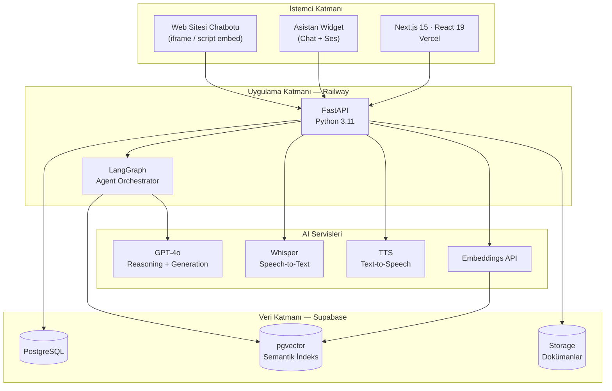
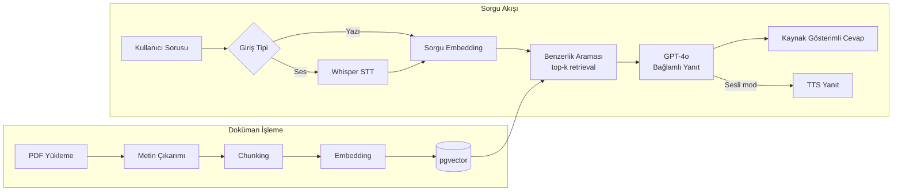
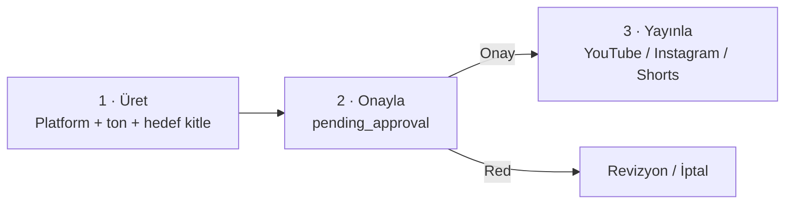

<div align="center">

# AdimOS

### Çok Ajanlı Yapay Zeka İşletim Sistemi

*Kurumsal bilgi tabanı, sesli asistan, içerik otomasyonu ve müşteri yönetimini tek panelde birleştiren AI platformu*

[](https://nextjs.org/)
[](https://react.dev/)
[](https://fastapi.tiangolo.com/)
[](https://www.python.org/)
[](https://langchain-ai.github.io/langgraph/)
[](https://supabase.com/)
[](https://openai.com/)

**Adım Müşavirlik & SGS Academy** için geliştirilmiştir.

</div>

---

## İçindekiler

- [Genel Bakış](#genel-bakış)
- [Temel Özellikler](#temel-özellikler)
- [Sistem Mimarisi](#sistem-mimarisi)
- [RAG Pipeline](#rag-pipeline)
- [Çok Ajanlı Sistem](#çok-ajanlı-sistem)
- [Asistan Widget](#asistan-widget)
- [Web Sitesi Chatbotu](#web-sitesi-chatbotu)
- [İçerik Otomasyonu](#içerik-otomasyonu)
- [Teknoloji Yığını](#teknoloji-yığını)
- [Proje Yapısı](#proje-yapısı)
- [Kurulum](#kurulum)
- [Yol Haritası](#yol-haritası)
- [Lisans](#lisans)

---

## Genel Bakış

AdimOS, bir danışmanlık şirketi ile eğitim akademisinin tüm operasyonel iş akışlarını yapay zeka ile otomatize eden, **production ortamında çalışan** çok ajanlı bir işletim sistemidir.

Sistem üç temel problemi çözer:

1. **Bilgi erişimi** — Şirketin yüzlerce sayfalık dokümantasyonu (PDF, mevzuat, eğitim materyali) pgvector tabanlı bir RAG mimarisiyle indekslenir; çalışanlar ve müşteriler doğal dilde (yazılı veya sesli) soru sorarak kaynak gösterimli yanıt alır.
2. **Operasyonel otomasyon** — Lead skorlama, müşteri takibi, otomatik follow-up mesajları ve yönetici özetleri, LangGraph üzerinde koşan 7 uzman ajan tarafından yürütülür.
3. **İçerik üretimi** — YouTube, Instagram ve Shorts içerikleri AI tarafından üretilir, insan onayından geçer ve platformlara otomatik yayınlanır (*human-in-the-loop*).

---

## Temel Özellikler

| Modül | Açıklama |
|-------|----------|
| **Bilgi Merkezi** | PDF/doküman yükleme → otomatik chunking → embedding → pgvector ile semantik arama |
| **Asistan Widget** | Her sayfada erişilebilen floating arayüz; yazılı chat + sesli asistan (STT/TTS) tek panelde |
| **Web Sitesi Chatbotu** | Dış web sitelerine `<script>` veya `<iframe>` ile gömülen AI chatbot; metin, ses ve dosya yükleme desteği |
| **Agent Ofisi** | 7 uzman AI ajanın durumunu ve çıktılarını izleyen kontrol paneli |
| **İçerik Otomasyonu** | Platform/ton/hedef kitle seçimiyle AI içerik üretimi ve onay akışı |
| **Müşteri Yönetimi** | Lead skorlama, müşteri yaşam döngüsü takibi |
| **SGS Akademi** | Öğrenci performans analizi ve kişiselleştirilmiş AI öğrenme planları |
| **Raporlar** | Sistem geneli analitik ve yönetici istatistikleri |

---

## Sistem Mimarisi



**Tasarım kararları:**

- **Frontend ve backend ayrık deploy edilir** (Vercel + Railway) — bağımsız ölçekleme ve sıfır kesintili frontend güncellemeleri için.
- **LangGraph**, ajanlar arası durum yönetimi ve koşullu yönlendirme sağlar; her ajan kendi alt grafiğinde izole çalışır.
- **pgvector**, ayrı bir vektör veritabanı bağımlılığını ortadan kaldırır; ilişkisel veri ile embedding'ler aynı PostgreSQL örneğinde tutulur, böylece tek transaction içinde tutarlılık korunur.

---

## RAG Pipeline



Her yanıt, dayandığı doküman parçalarına **kaynak referansı** ile döner — halüsinasyon riskini azaltmak ve denetlenebilirlik sağlamak için.

---

## Çok Ajanlı Sistem

7 uzman ajan, LangGraph orkestrasyonu altında çalışır:

| Agent | Sorumluluk | Tetikleyici |
|-------|-----------|-------------|
| **Knowledge Agent** | Doküman işleme ve RAG araması | Doküman yükleme / kullanıcı sorgusu |
| **Voice Agent** | Ses yönlendirme ve intent tespiti | Sesli giriş |
| **CEO Agent** | Günlük/haftalık yönetici özeti | Zamanlanmış görev |
| **CRM Agent** | Lead skorlama ve müşteri takibi | Yeni lead / durum değişikliği |
| **Follow-up Agent** | Otomatik takip mesajları | CRM Agent sinyali |
| **Learning Agent** | Öğrenci analizi ve öğrenme planı | Akademi modülü |
| **Automation Agent** | Sosyal medya içerik üretimi ve yayını | Kullanıcı talebi + onay |

Ajanlar birbirinden bağımsız çalışır ancak ortak durum (shared state) üzerinden haberleşir — örneğin CRM Agent'ın skorladığı bir lead, Follow-up Agent'ın takip akışını tetikler.

---

## Asistan Widget

Her sayfada sağ altta konumlanan birleşik asistan arayüzü:

```
"AdimOS ile konuş" → Panel açılır
  ├── Yazılı mod  : Soru yaz → RAG → GPT-4o → kaynaklı yanıt
  └── Sesli mod   : Mikrofon → Whisper STT → RAG → GPT-4o → TTS sesli yanıt
```

- Konuşma geçmişi oturum boyunca panelde tutulur; panel kapatıldığında sıfırlanır.
- Sesli ve yazılı mod aynı RAG altyapısını paylaşır — tek kaynak, tutarlı yanıt.

---

## Web Sitesi Chatbotu

Şirketin dış web sitesine gömülebilen, ziyaretçilere açık AI asistan:

```
Ziyaretçi web sitesinde yazar / konuşur / dosya yükler
        ↓
Widget  →  POST /api/v1/website/chat|voice
        ↓
Backend konuşmayı Supabase'e kaydeder
        ↓
AdimOS  →  /website sayfası  →  konuşma raporu
```

**Gömme yöntemleri:**

```html
<!-- Script ile (önerilen) — </body> öncesine ekleyin -->
<script src="https://your-adimos-url.vercel.app/embed.js"
  data-site-id="your-site-id"
  data-title="Asistanınız">
</script>

<!-- iframe ile — istediğiniz yere yerleştirin -->
<iframe src="https://your-adimos-url.vercel.app/widget?siteId=your-site-id"
  style="width:380px;height:600px;border:none;border-radius:16px;">
</iframe>
```

**Widget özellikleri:**

- Metin, sesli soru ve dosya yükleme (PDF, Excel, CSV) aynı arayüzde
- Konuşma geçmişi `sessionStorage`'da ziyaretçi oturumu boyunca tutulur
- Mobil uyumlu, responsive genişlik
- AdimOS dashboard'unda (`/website`) tüm konuşmalar rapor olarak görünür: ziyaretçi, mesaj sayısı, tarih, yüklenen dosyalar, tam konuşma detayı

**Backend endpoint'leri** *(kullanıcı tarafından yazılacak)*:

| Endpoint | Açıklama |
|----------|----------|
| `POST /website/chat` | Metin + dosya mesajı al, AI yanıtı döndür |
| `POST /website/voice` | Ses kaydı al, transcript + AI yanıtı döndür |
| `GET /website/conversations` | Konuşma listesi |
| `GET /website/conversations/{id}` | Konuşma detayı ve mesajlar |
| `GET /website/stats` | Toplam / bugün / aktif / dosya istatistikleri |

---

## İçerik Otomasyonu

Üç aşamalı, insan onaylı yayın akışı:



> **Güvenlik ilkesi:** Hiçbir içerik insan onayı olmadan yayınlanmaz. Tüm üretimler `pending_approval` durumunda bekler.

---

## Teknoloji Yığını

| Katman | Teknoloji | Neden? |
|--------|-----------|--------|
| Frontend | Next.js 15.3, React 19, TypeScript, Tailwind CSS | App Router, server components, tip güvenliği |
| Backend | FastAPI, Python 3.11 | Async-first, otomatik OpenAPI dokümantasyonu |
| Agent Orchestration | LangGraph | Durum yönetimli çok ajanlı akışlar |
| Veritabanı | Supabase (PostgreSQL + pgvector) | İlişkisel veri + vektör arama tek platformda |
| AI Modelleri | OpenAI GPT-4o, Whisper, TTS | Reasoning, STT, TTS tek sağlayıcıda |
| Deploy | Vercel (frontend) · Railway (backend) | Bağımsız ölçekleme, CI/CD entegrasyonu |

---

## Proje Yapısı

```
AdimOS/
├── frontend/web/
│   └── src/
│       ├── app/                # Next.js App Router sayfaları
│       │   ├── dashboard/      #   Kontrol Merkezi
│       │   ├── knowledge/      #   Bilgi Merkezi
│       │   ├── agents/         #   Agent Ofisi
│       │   ├── automation/     #   İçerik Otomasyonu
│       │   ├── crm/            #   Müşteri Yönetimi
│       │   ├── academy/        #   SGS Akademi
│       │   ├── website/        #   Web Sitesi konuşma raporu
│       │   ├── widget/         #   Embeddable chatbot (iframe / script)
│       │   ├── reports/        #   Raporlar
│       │   └── settings/       #   Ayarlar
│       ├── components/
│       │   ├── layout/         # AppShell, Sidebar, Header
│       │   ├── assistant/      # AssistantWidget — floating chat + ses
│       │   ├── ui/             # Tasarım sistemi bileşenleri
│       │   ├── dashboard/      # StatCard, DailyBriefCard
│       │   ├── knowledge/      # DocumentUpload, DocumentCard
│       │   ├── agents/         # AgentCard
│       │   └── automation/     # ContentCard, GenerateContentModal
│       ├── hooks/              # useAuth, useChat, useDocuments, useVoice
│       ├── services/           # Modül bazlı API istemcileri (+ widget.service)
│       ├── lib/                # Axios client, Supabase, sabitler
│       ├── types/              # TypeScript tip tanımları (+ widget.ts)
│       └── public/
│           └── embed.js        # Dış sitelere gömme scripti
├── backend/                    # FastAPI uygulaması + LangGraph ajanları
├── infrastructure/             # Supabase migrasyonları
├── docs/                       # Sistem dokümantasyonu
└── scripts/                    # Yardımcı scriptler
```

---

## Kurulum

### Gereksinimler

| Araç | Sürüm |
|------|-------|
| Node.js | 18+ |
| pnpm | son sürüm (`npm install -g pnpm`) |
| Python | 3.11+ |
| Supabase | aktif proje |
| OpenAI | API anahtarı |

### 1 · Repoyu Klonla

```bash
git clone https://github.com/your-org/adimos.git
cd adimos
```

### 2 · Ortam Değişkenleri

```bash
cp .env.example .env
cp frontend/web/.env.local.example frontend/web/.env.local
```

`.env.local` içinde en az şu değerler tanımlanmalıdır:

```env
NEXT_PUBLIC_SUPABASE_URL=...
NEXT_PUBLIC_SUPABASE_ANON_KEY=...
```

Tüm değişkenlerin açıklamaları için `.env.example` dosyasına bakın.

### 3 · Veritabanı Migrasyonları

Supabase SQL editöründe `infrastructure/supabase/migrations/` altındaki dosyaları **sırasıyla** çalıştırın.

### 4 · Backend

```bash
cd backend
python -m venv .venv
source .venv/bin/activate      # Linux/Mac
# .venv\Scripts\activate       # Windows
pip install -r requirements.txt
uvicorn app.main:app --reload --port 8000
```

| Servis | URL |
|--------|-----|
| API | http://localhost:8000 |
| Swagger | http://localhost:8000/docs |

### 5 · Frontend

```bash
cd frontend/web
pnpm install
pnpm dev
```

Arayüz: http://localhost:3000

---

## Yol Haritası

| Faz | Kapsam | Durum |
|-----|--------|:-----:|
| 1 | Bilgi tabanı, Asistan (Chat + Ses), Dashboard | ✅ Aktif |
| 2 | CRM, Follow-up Agent | 🔧 Hazırlanıyor |
| 3 | SGS Akademi | ✅ Aktif |
| 4 | İçerik Otomasyonu + Video Prodüksiyon | ✅ Aktif |
| 4b | Web Sitesi Chatbotu — frontend ✅, backend endpoint'leri bekliyor | ⏳ Kısmi |
| 5 | Raporlar ve analitik | 🔧 Hazırlanıyor |
| 6 | Çoklu kullanıcı, white-label | 📋 Planlandı |

---

## Lisans

Özel kullanım — **Adım Müşavirlik & SGS Academy**

Bu repo, mimari ve mühendislik yaklaşımını sergilemek amacıyla herkese açık tutulmaktadır. Kod ve içerik, izinsiz ticari kullanım için lisanslanmamıştır.
